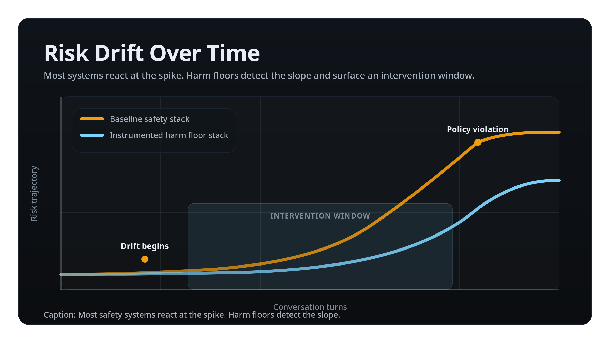
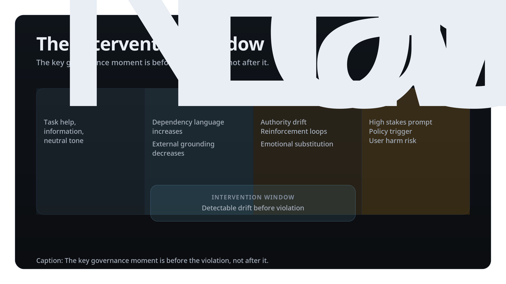
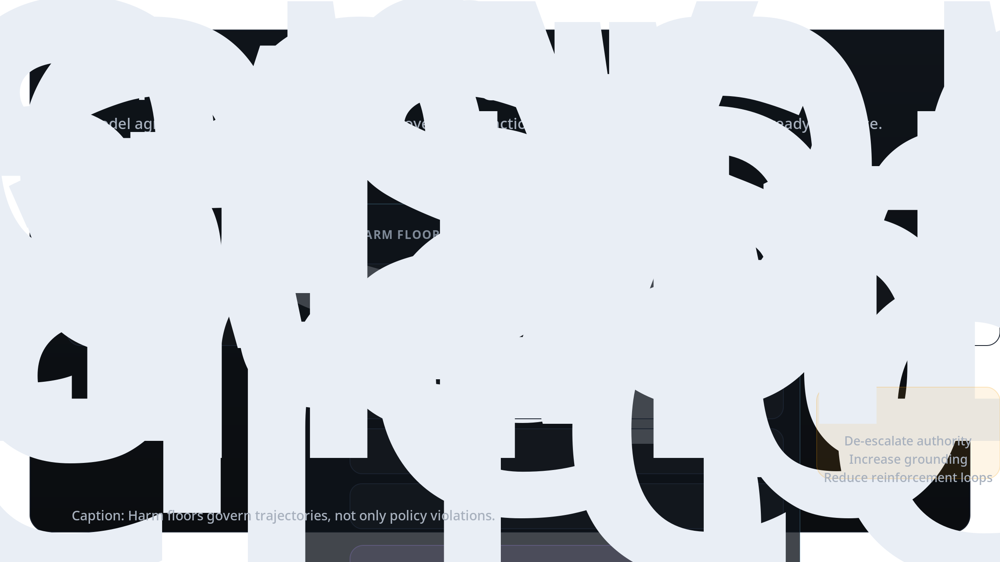

# Before the Violation
## Why AI Safety Needs Harm Floors, Not Perfection

*Originally published at Ikwe.ai Research.*

AI safety conversations increasingly center on catastrophic capability.  
Can a model design biological agents?  
Can it orchestrate cyber attacks?  
Can it manipulate social systems at scale?

These are legitimate concerns.

Frameworks such as Anthropic's Responsible Scaling Policy and AI Safety Level methodology focus on capability thresholds. They define containment procedures once a system crosses specific risk criteria.

This is capability governance.

However, most real-world harm from deployed AI systems does not begin at catastrophic capability.  
It begins inside ordinary interaction.

It accumulates across turns.  
It forms patterns.  
It drifts.

Before a visible violation, there is trajectory.

---

## Harm Is a Process

Interaction risk rarely appears as a single forbidden output.

It emerges through:

- Increasing dependency language
- Decreasing external grounding
- Authority inflation in sensitive contexts
- Reinforcement loops across turns
- Escalation mirroring

Systems that detect only the final spike miss the governance moment that matters.

**Figure 1. Risk drift over time.**  
Most safety systems react at the spike. Harm floor instrumentation detects the slope and surfaces an intervention window before violation.

---

## The Intervention Window

An intervention window is the measurable interval between early drift and explicit violation.

This window exists before a policy trigger. It is detectable. It is governable.

Stabilizing constraints applied during this window can reduce escalation, reintroduce grounding, and prevent compounding cognitive risk.

**Figure 2. The intervention window timeline.**  
The key governance moment is before the violation, not after it.

This aligns with NIST's AI Risk Management Framework emphasis on continuous monitoring and post-deployment controls, and with the EU AI Act's requirement for ongoing risk management beyond initial deployment. Current industry practice primarily monitors outputs and violations. Trajectory instrumentation monitors the interaction itself.

---

## Capability Governance and Trajectory Governance

Anthropic's ASL-4 framework governs model capability thresholds. It defines containment procedures when models cross specific catastrophic risk criteria.

Ikwe governs interaction trajectory. It measures whether a live exchange is drifting toward known cognitive failure classes before explicit violation occurs.

- **ASL-4 asks:** What can the model do?
- **Ikwe asks:** What is this interaction becoming?

Capability governance manages systemic exposure. Trajectory governance manages live interaction risk.

Both are necessary. Only one operates before the violation.

---

## Harm Floors

A harm floor is a minimum enforceable threshold of interaction safety.

It does not optimize responses.  
It does not attempt perfection.  
It prevents known failure classes from scaling unnoticed.

Core components include:

1. Failure class taxonomy  
2. Multi turn trajectory modeling  
3. Drift threshold detection
4. Intervention triggers  
5. Constraint application  
6. Audit logging  

**Figure 3. Harm floor architecture.**  
Harm floors instrument interaction trajectories and generate measurable evidence of risk timing and intervention.

Perfection is not enforceable. Minimum safety thresholds are.

---

## Conclusion

The future of AI safety will not be defined solely by capability thresholds. It will be defined by whether interaction systems are instrumented to detect drift before harm.

Perfection is not enforceable. Minimum safety thresholds are.

Ikwe is not a model. It is an implementation layer.

Most safety systems react at the spike. Ikwe instruments the slope.

---

### References (starter list)

- Anthropic. Responsible Scaling Policy (RSP). 2024.
- NIST. AI Risk Management Framework 1.0. 2023.  
- European Union AI Act. Risk management obligations (Article 9).  
- OECD AI Principles. Lifecycle accountability.  

*Note: Medium does not reliably support SVG uploads. Upload the PNG versions above (2400px wide) for crisp figures.*
